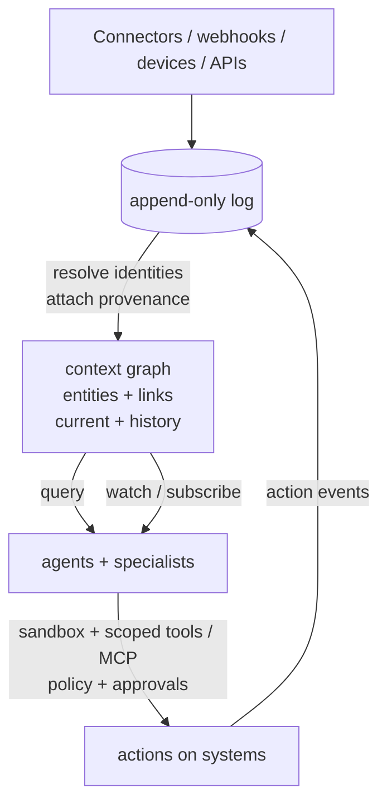

# Lobu — Give every agent a live model of your world

**Lobu is an open-source, event-sourced context layer for AI agents.** Every tool call, data
change, device signal, API event, and conversation becomes an event, linked to the entities and
identities it belongs to — a person, a project, a customer, a home, a company. That gives agents
a live, queryable model of your world instead of a transcript they forget when the session ends.

ChatGPT, Claude, Codex, and your own agents read and write that same permission-aware history and
current context, whether you're wiring up your own accounts or an entire company's stack. When a
responsibility should outlive one chat, any agent can discover and hand it to a persistent Lobu
specialist over MCP.

Connect your tools once. Every agent resumes from the same live context.

```text
WITHOUT LOBU                         WITH LOBU

Agent A -> Slack / GitHub / CRM      Slack  GitHub  CRM  DBs  Devices
Agent B -> Slack / GitHub / CRM         \      |     |    |     /
Agent C -> Slack / GitHub / CRM          +-----+-----+----+----+
                                                     |
Each agent re-fetches.                               v
Each session forgets.                       +-------------------+
                                             |       LOBU        |
                                             | events + entities |
                                             | history + policy  |
                                             +---------+---------+
                                                       |
                                                shared context
                                     +-----------------+-----------------+
                                     |                 |                 |
                                  ChatGPT         Claude / Codex      Your agents
```

## See it in ChatGPT

The 86-second narrated demo shows ChatGPT using Lobu over MCP to pull connected context and call
governed tools without leaving the conversation. The same shared context remains available to
Claude, Codex, and custom agents.

https://github.com/user-attachments/assets/c07e7c23-a29b-4b05-895e-51dcb935bac4

## Start with the agent you already use

Point any MCP client at Lobu. No Lobu agent runtime or `lobu.config.ts` is required.

```bash
# Claude Code
npx @lobu/cli@latest connect claude-code

# Codex
npx @lobu/cli@latest connect codex

# OpenCode
npx @lobu/cli@latest connect opencode
```

Complete OAuth when prompted, connect the sources you want to share, and ask your agent to use
Lobu when it needs shared context.

The same MCP endpoint works with **Claude Code, Codex, OpenCode, Antigravity, ChatGPT, Claude Desktop, Cursor**, and custom MCP clients. Run `lobu connect` to detect a client, install the supported MCP and skill bundle, or get the exact native handoff when the host requires UI setup. Authentication happens in that agent on first use.

Setup guides: [Claude](https://lobu.ai/connect-from/claude/) · [ChatGPT](https://lobu.ai/connect-from/chatgpt/) · [Codex](https://lobu.ai/connect-from/codex/) · [Grok](https://lobu.ai/connect-from/grok/)

Download Lobu: [Mac app](https://github.com/lobu-ai/lobu/releases/latest/download/Lobu.dmg) · [Chrome extension](https://chromewebstore.google.com/detail/jhgcecbdpnoehfnhpdfihlchjddapepi)

> Upgrading from the Owletto-named Mac build? Delete `/Applications/Owletto.app`
> after installing. Both names share one app identity, and the old bundle would
> otherwise linger beside the new one (in-app updates replace it in place, so
> this is only for manual DMG installs).

To test changes merged to `main`, run `bunx @lobu/cli@canary --help`. The
`canary` tag moves only when a maintainer runs **Publish Packages** from `main`
in GitHub Actions with channel `canary`; that run requires the commit's CI and
image checks and smokes the packed CLI before publishing. The published version
is then exercised across the Linux runtime matrix, so check the run's result before
depending on it. Use `@latest` for stable releases. Canary versions include the
full commit SHA so you can pin a preview when reproducing a bug. Package managers
can cache the moving tag: copy the exact version from the successful workflow run,
use it in place of `canary`, and confirm the installed version with `lobu --version`.

### Recall what the company knows

Ask from Claude Code, Codex, or ChatGPT:

> What did we decide about enterprise onboarding, and what changed since the last release?

Lobu searches shared, durable organizational memory under the caller's permissions, regardless of which agent asks. The answer can combine connected discussions, project activity, customer records, saved decisions, and typed company entities without rebuilding that context from scratch in every chat.

### Hand work to a persistent Lobu specialist

Ask your primary agent:

> Ask our customer-researcher specialist to review the latest feedback and propose the next three interviews.

The agent discovers the specialists available to you, selects the right one, delegates the task, and brings the result back. The specialist has its own identity, instructions, tools, durable conversations, and access policy.

To the user this stays one conversation in their primary agent. The specialist itself persists: it remains available to other authorized people and agents instead of disappearing with the current chat.

## Why Lobu

Instead of every agent rebuilding the same state through per-session tool calls, Lobu runs a shared data layer:

- **Connect once.** Polls, webhooks, APIs, and agent-written connectors feed one append-only event log.
- **Know once.** Events can be indexed as searchable knowledge and linked to typed entities such as companies, projects, incidents, and customers.
- **Use from any agent.** Authorized MCP clients read and contribute to the same organizational state according to their grants.
- **Delegate when useful.** Persistent Lobu specialists can own a role, conversation history, tools, and recurring responsibilities.
- **Keep control.** Identity, source permissions, approvals, credential brokering, provenance, and audit stay server-side.



**MCP is for doing. Lobu's event graph is for knowing.**

## One context layer, personal or company

The primitives don't change between a single person's accounts and an entire company's stack —
only what's connected does. Identities, entities, events, history, and policy work the same way
at either scope.

```text
PERSONAL                               COMPANY

WhatsApp  Gmail  Calendar  Mac        Slack  GitHub  CRM  DB
    \       |       |      /              \      |     |   /
     +------+-------+-----+                +------+-----+---+
                    \                      /
                     +------- LOBU -------+
                     | identities         |
                     | entities + events  |
                     | history + policy   |
                     +---------+----------+
                               |
                      shared agent context
                  +------------+------------+
                  |                         |
       "When is Alice home?"      "Why is Acme at risk?"
```

## Three ways to use Lobu

### 1. Add shared context to existing agents

Agents can search and save memory, query structured entities, inspect connected sources, and delegate to Lobu specialists without moving to a new chat interface or adopting Lobu's runtime.

Docs: [Memory](https://lobu.ai/getting-started/memory/) · [Claude](https://lobu.ai/connect-from/claude/) · [ChatGPT](https://lobu.ai/connect-from/chatgpt/) · [Codex](https://lobu.ai/connect-from/codex/)

### 2. Run persistent Lobu specialists

Create a specialist for a durable responsibility: customer research, support triage, release coordination, incident follow-up, or an internal domain. People can talk to it from the Lobu web app or Slack, while other agents can call the same specialist over MCP.

Scaffold and run one locally:

```bash
npx @lobu/cli@latest init my-specialist
cd my-specialist
npx @lobu/cli@latest run
npx @lobu/cli@latest chat -c local "hello"
```

`lobu run` starts the local stack with an embedded Postgres database by default and opens the web UI on `:8787`. It applies the project's `lobu.config.ts` automatically only in embedded mode. To use external Postgres, set `DATABASE_URL`, ensure pgvector is available, then authenticate and apply the project to that runtime separately.

The current canary CLI downloads the required runtime components on first use and caches them for later runs. `--help`, `--version`, and commands that only connect to a remote runtime do not install the local stack. Docker images include their runtime dependencies at build time and start directly; local embedding model weights can still download on first use. See [Docker deployment](docs/DOCKER.md) for the separate database and service configuration.

`lobu init`, including `init -y`, generates `ENCRYPTION_KEY` in the project's `.env`. A manual setup must supply this key before starting: generate a 32-byte base64 value with `openssl rand -base64 32`. Keep the same key with the persistent database; replacing it makes previously encrypted secrets unreadable.

Docs: [Getting started](https://lobu.ai/getting-started/) · [Agent workspace](https://lobu.ai/guides/agent-prompts/) · [Skills](https://lobu.ai/getting-started/skills/) · [Slack](https://lobu.ai/platforms/slack/)

### 3. Build with the CLI and TypeScript SDK

The same governed data and operations are available without an agent:

```bash
npx @lobu/cli@latest memory run                     # list the memory tools
npx @lobu/cli@latest memory run search_memory '{"query":"onboarding"}'
npx @lobu/cli@latest memory exec \
  'export default async (_ctx, client) => client.entities.list({ limit: 5 })'
```

Or from Node and TypeScript:

```ts
import { client, searchMemory } from "@lobu/client";

client.setConfig({
  baseUrl: "https://lobu.ai",
  headers: { Authorization: `Bearer ${process.env.LOBU_TOKEN}` },
});

const hits = await searchMemory({
  path: { orgSlug: "my-org" },
  body: { query: "onboarding" },
});
```

Mint a token with `lobu token create`. The MCP tools and typed SDK operations share the server-side tool registry and access rules; `lobu memory run` and `lobu memory exec` dispatch through the MCP endpoint.

## Core concepts

### Shared context

[Connectors](https://lobu.ai/getting-started/author-a-connector/) collect activity on a schedule or through webhooks. Discussions, project changes, customer records, API events, and saved agent knowledge land in the same append-only history.

Typed entities connect that history to the things you care about: `Company`, `Project`, `Customer`, `Incident`, or schemas you define. Corrections supersede old facts rather than erasing their provenance.

Connectors are extensible. You can build them in TypeScript, and coding agents can use Lobu's connector contract and validation flow to create integrations for sources Lobu does not ship with.

Docs: [Memory](https://lobu.ai/getting-started/memory/) · [Connectors](https://lobu.ai/getting-started/author-a-connector/) · [API](https://lobu.ai/reference/api-reference/)

### Persistent specialists

A Lobu specialist has a stable role, instructions, memory, tools, and conversation history. It can be reached from web chat or Slack and called by external agents through `client.conversations.send`.

Specialists use role files for identity and instructions: `IDENTITY.md`, `SOUL.md`, and `USER.md`. Guardrails can inspect input, output, and tool calls. Destructive MCP calls require in-thread approval unless they are explicitly pre-approved through `defineAgent({ tools: { preApproved } })` in `lobu.config.ts`; action results return to the shared event log.

External agents do not ask users to write delegation code. They pass scripts like these to Lobu's `query_sdk` and `run_sdk` MCP tools:

Scripts must default-export an async function. Lobu passes the execution context as the first argument and the ClientSDK as the second; keep `await` and `return` inside that function. A bare top-level `await` or `return` fails compilation. The same function format works with `lobu memory exec`.

```ts
// Discover specialists through query_sdk.
export default async (_ctx, client) => {
  const { agents } = await client.agents.list();
  return agents;
};
```

```ts
// Delegate through run_sdk and wait for the specialist's reply.
export default async (_ctx, client) => {
  return client.conversations.send({
    agent_id: "customer-researcher",
    thread: "enterprise-onboarding",
    text: "Review the latest customer feedback and propose the next three interviews.",
  });
};
```

Docs: [Agent workspace](https://lobu.ai/guides/agent-prompts/) · [Guardrails](https://lobu.ai/guides/guardrails/) · [Security](https://lobu.ai/guides/security/)

### Automations

Automations are versioned background responsibilities activated manually, on a schedule, by a connector event, or by another Automation's durable output. They read governed sources, persist structured results, and can notify Slack, open a ticket, or start agent work while nobody is in chat.

Collection and activation stay independent: connect a source once, keep its durable history useful to every authorized agent, then choose whether a responsibility should run on a schedule or immediately when a matching event arrives. Polling connectors, authenticated webhooks, and Automation outputs use their appropriate ingestion paths but converge on the same durable Automation run lifecycle. Initial syncs establish a baseline without flooding subscribers; repeated deliveries are deduplicated.

See the [activation and chaining model](docs/AUTOMATIONS.md).

### Optional execution

Shared context and delegation over MCP do not require Lobu to execute code for the calling agent. When a Lobu specialist needs a shell, the built-in runtime provides lightweight `just-bash` execution. Remote sandbox providers such as Vercel Sandbox can be connected for workloads that need stronger isolation or more compute.

Which sandbox runs the code is a deployment choice. Lobu provides the shared context, permissions, and governance around it.

## Channels

Lobu specialists can serve **Slack, Telegram, WhatsApp, Discord, Teams, Google Chat**, the web app, and a [REST API](https://lobu.ai/reference/api-reference/). Channel conversations remain separate while reading the same authorized organizational context.

Setup: [Slack](https://lobu.ai/platforms/slack/) · [Telegram](https://lobu.ai/platforms/telegram/) · [Discord](https://lobu.ai/platforms/discord/) · [WhatsApp](https://lobu.ai/platforms/whatsapp/) · [Teams](https://lobu.ai/platforms/teams/) · [Google Chat](https://lobu.ai/platforms/google-chat/)

## How Lobu differs

- **Agent frameworks** help developers implement an agent loop. Lobu gives agents and people a shared organizational state and a place to keep persistent specialists.
- **Direct MCP integrations** expose tools from one provider. Lobu continuously builds durable, cross-source context that every authorized agent can reuse.
- **Agent runtimes** host a particular agent. Lobu lets people keep using Claude Code, Codex, ChatGPT, or their own runtime and add Lobu only where shared context or delegation is useful.
- **Workflow engines** encode a graph of predetermined steps. Lobu Automations handle durable triggers and background responsibilities, while agents decide how to complete open-ended work.

## Agent configuration

Runtime configuration is managed through the web app or the same org-scoped REST API used by the CLI. Local `lobu.config.ts` projects support validation and repeatable apply workflows.

```bash
npx @lobu/cli@latest login
npx @lobu/cli@latest org set my-org
npx @lobu/cli@latest agent list
```

Docs: [CLI reference](https://lobu.ai/reference/cli/) · [`lobu apply`](https://lobu.ai/reference/cli/#apply)

## Deployment

Use the embedded runtime locally or self-host Lobu with external Postgres. Production guides: [Docker](https://lobu.ai/deployment/docker/) · [Cloud](https://lobu.ai/deployment/cloud/) · [Kubernetes](https://lobu.ai/deployment/kubernetes/)

## Security and privacy

Permissions and audit stay on Lobu's gateway. Lobu MCP servers and the credential-brokering layer handle provider and connector credentials, OAuth and token refresh, and third-party API proxying. Workers receive scoped placeholders or short-lived provider-derived access, never OAuth tokens or durable stored credentials. Destructive MCP calls require in-thread approval unless explicitly pre-approved, and connected data remains organization-scoped.

The built-in `just-bash` and embedded execution modes are policy and convenience boundaries, not VMs for hostile code. Use a remote sandbox provider when the workload needs a stronger isolation boundary.

Docs: [Security](https://lobu.ai/guides/security/) · [Secret proxy](https://lobu.ai/guides/secret-proxy/) · [Guardrails](https://lobu.ai/guides/guardrails/) · [Threat model](docs/SECURITY.md)

## Design partners

We are working with technical teams that already use Claude Code, Codex, ChatGPT, or custom agents and want those agents to share company context or delegate to persistent specialists.

The best starting point is one team, one or two connected sources, and one repeated responsibility. [Talk to the founder](https://lobu.ai/schedule/) or reach out on [X/Twitter](https://x.com/bu7emba).
