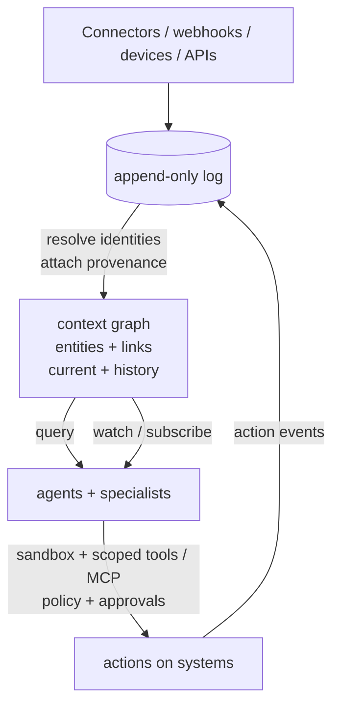

# Lobu — Give every agent a live model of your world

**Lobu is an open-source, event-sourced context layer for AI agents.** Every tool call, data
change, device signal, API event, and conversation becomes an event, linked to the entities and
identities it belongs to — a person, a project, a customer, a home, a company. That gives agents
a live, queryable model of your world instead of a transcript they forget when the session ends.

ChatGPT, Claude, Codex, and your own agents read and write that same permission-aware history and
current context, whether you're wiring up your own accounts or an entire company's stack. When a
responsibility should outlive one chat, any agent can discover and hand it to a persistent Lobu
specialist over MCP.

Connect your tools once. Every agent resumes from the same live context.

```text
WITHOUT LOBU                         WITH LOBU

Agent A -> Slack / GitHub / CRM      Slack  GitHub  CRM  DBs  Devices
Agent B -> Slack / GitHub / CRM         \      |     |    |     /
Agent C -> Slack / GitHub / CRM          +-----+-----+----+----+
                                                     |
Each agent re-fetches.                               v
Each session forgets.                       +-------------------+
                                             |       LOBU        |
                                             | events + entities |
                                             | history + policy  |
                                             +---------+---------+
                                                       |
                                                shared context
                                     +-----------------+-----------------+
                                     |                 |                 |
                                  ChatGPT         Claude / Codex      Your agents
```

## See it in ChatGPT

The 86-second muted demo shows ChatGPT using Lobu over MCP to pull connected context and call
governed tools without leaving the conversation. The same shared context remains available to
Claude, Codex, and custom agents.

<video src="docs/assets/chatgpt-demo-muted.mp4" width="100%" controls></video>

## Start with the agent you already use

Point any MCP client at Lobu. No Lobu agent runtime or `lobu.config.ts` is required.

```bash
# Claude Code
npx @lobu/cli@latest connect claude-code

# Codex
npx @lobu/cli@latest connect codex

# OpenCode
npx @lobu/cli@latest connect opencode
```

Complete OAuth when prompted, connect the sources you want to share, and ask your agent to use
Lobu when it needs shared context.

The same MCP endpoint works with **Claude Code, Codex, OpenCode, Antigravity, ChatGPT, Claude Desktop, Cursor**, and custom MCP clients. Run `lobu connect` to detect a client, install the supported MCP and skill bundle, or get the exact native handoff when the host requires UI setup. Authentication happens in that agent on first use.

Setup guides: [Claude](https://lobu.ai/connect-from/claude/) · [ChatGPT](https://lobu.ai/connect-from/chatgpt/) · [Codex](https://lobu.ai/connect-from/codex/)

Download Lobu: [Mac app](https://github.com/lobu-ai/lobu/releases/latest/download/Lobu.dmg) · [Chrome extension](https://chromewebstore.google.com/detail/jhgcecbdpnoehfnhpdfihlchjddapepi)

## Why Lobu

Instead of every agent rebuilding the same state through per-session tool calls, Lobu runs a shared data layer:

- **Connect once.** Polls, webhooks, APIs, and agent-written connectors feed one append-only event log.
- **Know once.** Events can be indexed as searchable knowledge and linked to typed entities such as companies, projects, incidents, and customers.
- **Use from any agent.** Authorized MCP clients read and contribute to the same organizational state according to their grants.
- **Delegate when useful.** Persistent Lobu specialists can own a role, conversation history, tools, and recurring responsibilities.
- **Keep control.** Identity, source permissions, approvals, credential brokering, provenance, and audit stay server-side.



## Core concepts

### Shared context

[Connectors](https://lobu.ai/getting-started/author-a-connector/) collect activity on a schedule or through webhooks. Discussions, project changes, customer records, API events, and saved agent knowledge land in the same append-only history.

Typed entities connect that history to the things you care about: `Company`, `Project`, `Customer`, `Incident`, or schemas you define. Corrections supersede old facts rather than erasing their provenance.

Connectors are extensible. You can build them in TypeScript, and coding agents can use Lobu's connector contract and validation flow to create integrations for sources Lobu does not ship with.

Docs: [Memory](https://lobu.ai/getting-started/memory/) · [Connectors](https://lobu.ai/getting-started/author-a-connector/) · [API](https://lobu.ai/reference/api-reference/)

### Persistent specialists

A Lobu specialist has a stable role, instructions, memory, tools, and conversation history. It can be reached from web chat or Slack and called by external agents through `client.conversations.send`.

Specialists use role files for identity and instructions: `IDENTITY.md`, `SOUL.md`, and `USER.md`. Guardrails can inspect input, output, and tool calls. Destructive MCP calls require in-thread approval unless they are explicitly pre-approved through `defineAgent({ tools: { preApproved } })` in `lobu.config.ts`; action results return to the shared event log.

External agents do not ask users to write delegation code. They pass scripts like these to Lobu's `query_sdk` and `run_sdk` MCP tools:

Scripts must default-export an async function receiving `(ctx, client)` — the same shape `lobu memory exec` accepts.

```ts
// Discover specialists through query_sdk.
export default async (_ctx, client) => {
  const { agents } = await client.agents.list();
  return agents;
};
```

```ts
// Delegate through run_sdk and wait for the specialist's reply.
export default async (_ctx, client) => {
  return client.conversations.send({
    agent_id: "customer-researcher",
    thread: "enterprise-onboarding",
    text: "Review the latest customer feedback and propose the next three interviews.",
  });
};
```

Docs: [Agent workspace](https://lobu.ai/guides/agent-prompts/) · [Guardrails](https://lobu.ai/guides/guardrails/) · [Security](https://lobu.ai/guides/security/)

### Automations

Automations are versioned background responsibilities activated manually, on a schedule, by a connector event, or by another Automation's durable output. They read governed sources, persist structured results, and can notify Slack, open a ticket, or start agent work while nobody is in chat.

Collection and activation stay independent: polling connectors, authenticated webhooks, and Automation outputs all converge on the same durable run lifecycle. First syncs set a quiet baseline; redeliveries are deduplicated.

See the [activation and chaining model](docs/AUTOMATIONS.md).

### Optional execution

Shared context and delegation over MCP do not require Lobu to execute code for the calling agent. When a Lobu specialist needs a shell, the built-in runtime provides lightweight `just-bash` execution, or a remote sandbox provider for workloads that need stronger isolation.

## Channels

Lobu specialists can serve **Slack, Telegram, WhatsApp, Discord, Teams, Google Chat**, the web app, and a [REST API](https://lobu.ai/reference/api-reference/). Channel conversations remain separate while reading the same authorized organizational context.

Setup: [Slack](https://lobu.ai/platforms/slack/) · [Telegram](https://lobu.ai/platforms/telegram/) · [Discord](https://lobu.ai/platforms/discord/) · [WhatsApp](https://lobu.ai/platforms/whatsapp/) · [Teams](https://lobu.ai/platforms/teams/) · [Google Chat](https://lobu.ai/platforms/google-chat/)

## How Lobu differs

- **Agent frameworks** help developers implement an agent loop. Lobu gives agents and people a shared organizational state and a place to keep persistent specialists.
- **Direct MCP integrations** expose tools from one provider. Lobu continuously builds durable, cross-source context that every authorized agent can reuse.
- **Agent runtimes** host a particular agent. Lobu lets people keep using Claude Code, Codex, ChatGPT, or their own runtime and add Lobu only where shared context or delegation is useful.
- **Workflow engines** encode a graph of predetermined steps. Lobu Automations handle durable triggers and background responsibilities, while agents decide how to complete open-ended work.

## Run and configure

Use the embedded runtime locally or self-host Lobu with external Postgres. Runtime configuration lives in the web app or the same org-scoped REST API used by the CLI; local `lobu.config.ts` projects support validation and repeatable apply workflows.

```bash
npx @lobu/cli@latest login
npx @lobu/cli@latest org set my-org
npx @lobu/cli@latest agent list
```

Docs: [CLI reference](https://lobu.ai/reference/cli/) · [`lobu apply`](https://lobu.ai/reference/cli/#apply) · [Docker](https://lobu.ai/deployment/docker/) · [Cloud](https://lobu.ai/deployment/cloud/) · [Kubernetes](https://lobu.ai/deployment/kubernetes/)

## Security and privacy

Permissions and audit stay on Lobu's gateway: credential brokering, OAuth and token refresh, and third-party API proxying are server-side. Workers receive scoped placeholders or short-lived provider-derived access, never OAuth tokens or durable stored credentials. Destructive MCP calls require in-thread approval unless explicitly pre-approved, and connected data remains organization-scoped. The built-in `just-bash` and embedded execution modes are convenience boundaries, not isolation VMs — use a remote sandbox for hostile code.

Docs: [Security](https://lobu.ai/guides/security/) · [Secret proxy](https://lobu.ai/guides/secret-proxy/) · [Guardrails](https://lobu.ai/guides/guardrails/) · [Threat model](docs/SECURITY.md)

## Design partners

We are working with technical teams that already use Claude Code, Codex, ChatGPT, or custom agents and want those agents to share company context or delegate to persistent specialists.

The best starting point is one team, one or two connected sources, and one repeated responsibility. [Talk to the founder](https://lobu.ai/schedule/) or reach out on [X/Twitter](https://x.com/bu7emba).
