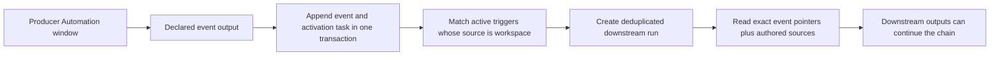

# Automations: activation, data, outputs, and chaining

This is the source map for Lobu's Automation primitives. It describes what the
product supports now, how the pieces compose, and where a dedicated workflow
engine would still add something real.

## The core model

An Automation is a versioned task owned by an agent. Its fields have separate
jobs:

| Primitive | What it decides | What it does not decide |
|---|---|---|
| Trigger | When a run starts | What durable context the run may read |
| Executor | Whether a managed agent, device CLI, or sandboxed script runs the job | When it starts |
| Prompt and skills | What the agent should do | When it starts |
| Sources | What additional governed data a window reads | Whether new data activates it |
| Outputs | Which entity rows or append-only events a completed window persists | External side effects |
| Reaction or connector action | Which governed side effect follows analysis | The durable output contract |
| Run | Claiming, retries, busy policy, cooldown, audit, and status | Business meaning |
| ACL and approval policy | What the principal may read or change | Scheduling |

SQL sources are reads. An Automation does not gain an ungoverned database-write
escape hatch by declaring SQL. Persisted changes go through declared outputs,
the ClientSDK, reactions, connector actions, and their existing ACL or approval
rails.

## Script execution

A deterministic job can use `executor: scriptFromFile("./digest.script.ts", params)`
in `defineAutomation`. The API form is
`execution_config: { executor: { kind: "script", source, params? } }`.
`managed_agent_id` remains the owning agent for SDK permissions. No model turn,
MCP completion handshake, or dummy extraction object is required.

The module exports `default async (ctx, client, params?)`. `ctx.window` contains
its durable run ID and pinned bounds; scheduled and manual windows use arrival
time (`events.created_at`), while event activations carry their signal bounds
and `ctx.trigger_signals`. The script owns its SDK reads and writes and may
return a JSON object for the run result, or return no value.

Activation freezes the code, parameters, version, and window on the run. A durable
sandbox task executes it with the same scoped SDK and autonomous approval rules
as a reaction. The sandbox has a 60-second attempt limit and up to three attempts;
deterministic failures stop immediately. A successful script commits its result
and advances a scheduled/manual arrival window. Failure never advances the
arrival mark. Task exhaustion is reconciled into a failed Automation run.
External effects are at-least-once: use `ctx.window.run_id` in idempotency keys.
Scripts must handle gated or pending SDK results before returning success.

Script jobs cannot use device pins, agent skills, extraction outputs, or model/
CLI settings; those require agent execution. Scripted eval capture is currently
unavailable and fails explicitly. An optional reaction still runs after the
script's successful completion, through the existing durable reaction queue.
For agent Automations, completion still precedes their reaction.
Event scripts use silent triggers and send any desired replies through the SDK;
`reply_to_source` is reserved for agent responses.

`lobu apply` preserves an omitted executor; `executor: "agent"` explicitly removes
a stored script executor. Switching an existing reaction-driven job requires
removing its old reaction so the same work is not performed twice.

## Scheduling and admission

Feeds and scheduled Automations share cron parsing, due-item materialization,
the durable `runs` table, dedupe, claiming, status, and observability. They do
not share one admission clock:

| Work | Due work is admitted by | Why |
|---|---|---|
| Scheduled Automation | The per-minute `automation` TaskScheduler tick | Execution is server-dispatched and the tick also reconciles stranded runs. |
| Connector feed | An eligible idle worker poll | Capability, placement, and worker liveness are known before a run is created, avoiding durable but unclaimable syncs. |

The consolidation boundary is therefore the durable run and event lifecycle,
not a universal scheduler. Connector events, generic webhook deliveries,
workspace-output events, and schedules all create the same Automation run shape;
the periodic Automation tick is the recovery path when immediate event dispatch
fails. Moving feed admission into the global clock would add a second placement
queue without removing any existing mechanism.

## Window recovery and external processors

Windows select rows by `events.created_at` — when Lobu STORED the row, not when
the content is dated. A connector routinely stores rows long after the fact: in
production 56.3% of first-seen rows arrived more than an hour after their
`occurred_at` and 37.8% more than seven days after, so a calendar window closed
before its content ever landed and no run saw it.

Each Automation therefore carries one durable arrival mark,
`automations.next_window_start`, and a run covers `[mark, now - settle)`. The
mark advances only when a window completes, including a legitimate zero-source
result; failed, timed-out, abandoned, and lease-expired attempts leave it where
it is, so the same arrivals stay claimable. There is no backlog of calendar
periods to walk: one window spans the uncompleted arrival range. Completing it
still requires reading its governed inputs within the source and execution
limits described below.

The cadence still decides WHEN a run fires; it no longer shapes what the run
covers. `settle` is `AUTOMATION_ARRIVAL_SETTLE_MS` (default 60s): `created_at` is
stamped at the writer's transaction start while the row only becomes visible at
commit, so a window stops one writer-transaction short of the clock. A row stored
inside the settle window belongs to the next run, never to none.

Repeated execution failures are bounded by a schedule circuit breaker. After
`AUTOMATION_PAUSE_AFTER_CONSECUTIVE_FAILURES` consecutive scheduled runs fail or
time out (default five), Lobu keeps the Automation active but stamps
`schedule_auto_paused_at` and clears `next_run_at`. Event, eval, manual,
dispatch-only, cancelled, and never-executed runs do not increment the counter.
A successful scheduled or manual window, or a real schedule/timezone change,
clears the failure state and resumes the cursor. A scheduled notification sweep
durably notifies workspace admins and owners once per pause generation.

`pending_analysis.next_window` is the arrival range a claim would hand out, or
null while the mark is younger than the settle budget (a just-created or
just-seeded Automation).
`unprocessed_content_count` separately counts source items not linked to a
completed Automation run. Presentation pagination and date filters affect only
the returned completed-window list, never these global diagnostics.

An agent may still ask for an explicit `since`/`until` range. A range that starts
AFTER the mark books nothing when it completes: the arrivals it stepped over stay
claimable, and `window_lag.unclaimed_from` / `unclaimed_to` plus a `guidance`
sentence say so in the payload the run actually reads. A range entirely behind
the mark is a re-read and books nothing either. Coverage therefore stays one
contiguous span and can never develop a hole.

An external processor starts with an atomic claim instead of a separate read and
run creation:

```ts
const claim = await client.automations.claimNextWindow({
  automation_id: "42",
  lease_seconds: 900,
  limit: 100,
});

const tokens = [claim.context.window_token];
let page = claim.context.page;
while (page.has_more) {
  const continuation = await client.automations.claimNextWindow({
    automation_id: "42",
    run_id: claim.run_id,
    limit: 100,
    before_occurred_at: page.next_cursor.occurred_at,
    before_id: page.next_cursor.id,
  });
  tokens.push(continuation.context.window_token);
  page = continuation.context.page;
}

for (const [source_name, firstPage] of Object.entries(claim.context.sources_page ?? {})) {
  let source_cursor = firstPage.next_cursor;
  while (source_cursor) {
    const continuation = await client.automations.claimNextWindow({
      automation_id: "42",
      run_id: claim.run_id,
      source_name,
      source_cursor,
      limit: 100,
    });
    // Process/reduce continuation.context.sources[source_name] in code.
    tokens.push(continuation.context.window_token);
    source_cursor = continuation.context.sources_page[source_name].next_cursor;
  }
}

await client.automations.completeWindow({
  automation_id: "42",
  run_id: claim.run_id,
  window_tokens: tokens,
  extracted_data,
});
```

**Every claim must end in a `completeWindow` call, including a window that held
nothing worth acting on.** The arrival mark advances only inside the completion
transaction, so a claim that is simply abandoned lets the lease expire, marks the
run `timeout`, leaves the mark where it was, and serves the same arrivals again on
the next claim — indefinitely. Submit the completion with whatever the extraction
contract allows for an empty result rather than dropping the lease; nothing is
lost by completing an empty window, because the mark only ever moves forward over
arrivals the run was actually shown.

A feed with `readWindowAxis` uses its live reader for `@feed` sources. Other
sync-capable feeds retain their stored-arrival read. Read-only feeds must support
the window contract or fail explicitly. Live rows are not copied into `events`
and their provider IDs are never treated as stored event IDs. The connector
receives the fixed `[start, end)` bounds and acknowledges its source timestamp
axis in `sources_page[name].window_axis`. This describes source time, not Lobu
arrival time: for example, Gmail uses message receipt time and Drive uses file
modification time. It does not promise deletion history or delayed-import
coverage. Readers needing those guarantees must use provider change tracking.

Each live source has an independent cursor chain. All required chains must be
complete before checkpoint advancement, even when a page is empty. The chain
also binds the feed configuration and connector version; changes mid-read fail
instead of combining different queries. SQL summaries remain ordinary context
sources. A processor can reduce pages in code and return only a summary to the
model. Automatic unchanged-source skipping is disabled for live sources because
an unqueried or partial source cannot prove an unchanged window.

The database serializes claims per Automation. The signed tokens bind the exact
window, run attempt, lease, source IDs, and page chain. A stale attempt cannot
complete after a newer claim, while retrying an already committed completion is
idempotent even after its lease expires. If a non-pageable source exceeds its
bound, completion fails closed and the Automation source must be narrowed. An
assigned `managed_agent_id` does not exclude external claiming; ordinary
internal dispatch through that agent continues to use the same run lifecycle.

### Consistent SQL drill-downs

Stored event sources select the versions that existed at the exclusive window
end. A refresh after that end cannot remove an earlier version between the
source summary and a later query. A successor stored before the end replaces
its predecessor; a successor stored exactly at the end belongs to the next
window. Tombstones follow the same rule.

Use the latest page token when querying the window in SQL. For a run-bound
knowledge read, the token is on the full response:

```ts
const windowRead = await client.knowledge.read({
  automation_id: 42,
  run_id: runId,
  limit: 25,
});
const rows = await client.query(
  "SELECT connector_key, COUNT(*)::int AS count FROM events GROUP BY connector_key",
  { window_token: windowRead.window_token },
);
```

The `query_sql` tool accepts the same `window_token` argument. Both paths reuse
the source query compiler's arrival bounds, entity scope, self-output exclusion,
and event-version selection. Apply any additional authored source filters in
the drill-down query. Retain every analyzed page token for `completeWindow`;
SQL does not itself add event citations or discharge source pagination.

Only run-bound tokens are accepted. The signature, owning workspace, queued
bounds, run state and lease are validated. External claim continuations renew
the lease, so use the newest returned token for subsequent SQL. Tokens cannot
be combined with external-database connection pushdown.

This is stored event-version consistency, not a frozen database: entity fields,
classifications, authorization and remote providers can change. Current access
permissions are checked on every read. Ordinary SQL and search still select
current events. The existing arrival settlement delay still applies to writers
that have not committed.

## Activation types

The `triggers` array is an OR: any matching trigger may start the Automation. If
more than one trigger matches the same delivery, the first matching trigger's
execution and busy policy wins.

| Trigger | Use it for | Default execution | Busy default |
|---|---|---|---|
| No trigger | Explicit manual/API/SDK runs | Window | Existing run policy |
| `schedule` | Time-based analysis | Window | Coalesce |
| `event`, `source: "connector"` | Authenticated connector deliveries such as a Slack message or GitHub PR | Turn | Queue |
| `event`, `source: "workspace"` | A declared durable event output from another Automation | Window | Coalesce |

`event` is one public trigger primitive; `source` records its provenance.
Existing connector triggers that omit `source` remain readable and normalize to
`source: "connector"` on write. A connector's declared `automationEvents` are the
allowed catalog for connector-sourced events; when a connector declares none,
the platform derives the catalog from its feed `eventKinds` (default-on). Each
declared kind becomes a subscribable event type. A feed's first successful
non-dry sync establishes its baseline without activation; later inserts of a
matching kind activate subscribers. Entity-type `eventKinds` describe durable
workspace semantics and are the catalog for workspace-sourced events.

The generic `webhook` connector exposes `delivery.received`. Its authenticated
JSON row and matching Automation run commit together, so low-latency webhook
processing uses the same connector-event lifecycle as a polled feed rather than
a second webhook scheduler. It defaults to turn/queue so every delivery carries
its bounded input directly. Choose window/coalesce explicitly for batch-style
analysis over a configured source.

Sources never activate an Automation. A subscription is the trigger declaration
that gives an event immediate activation semantics; it is not a second mutable
subscription record.

The UI mirrors this contract: choose **Event**, select either **Current
workspace** or an active connection as the **Source**, then choose one or more
catalog events in the searchable **Events** multi-select. New Event triggers
default to the current workspace. Its catalog combines the declared event kinds
in that organization; an optional entity-type filter lives under **Trigger
options** for the narrower case. One trigger may group events only when they
share the same source, filters, and run options.

## Automation-to-Automation chaining

Only newly persisted events from a declared Automation output activate
triggers with `source: "workspace"`. Ordinary `save_memory` calls, connector
ingestion, and arbitrary rows already in `events` do not activate those
workspace-source triggers. Connector ingestion can separately activate matching
`source: "connector"` triggers through its resolved catalog. This explicit
producer boundary prevents every knowledge write from accidentally becoming a
workflow command.



The handoff is pointer-based. A signal carries the event ID, delivery ID, bounded
root event IDs, causal Automation IDs, and depth — not a copied payload. Turn execution
reads the exact event once. Window execution adds the exact event IDs to the
same governed knowledge read as the authored sources and signs them into the
window token.

The output event and activation task commit atomically. The activation worker
runs after commit, makes up to five attempts, and uses the existing run queue for
claiming, backoff, idempotency, cooldown, dispatch, and Activity visibility.
Replaying the same completed output does not create another activation.

### Config example

The subscribed `event_types` are validated against the organization's declared
entity-type `eventKinds`, so the kind the producer emits has to exist in the
schema before either Automation applies:

```ts
const account = defineEntityType({
  key: "account",
  eventKinds: {
    observation: { description: "A material observation about an account." },
  },
});

const detectRisk = defineAutomation({
  agent,
  slug: "detect-risk",
  prompt: "Find material account risks. Emit observations with namespace account-risk.",
  triggers: [every("0 * * * *")],
  sources: {
    accounts:
      "SELECT id, payload_text, metadata, occurred_at FROM events ORDER BY occurred_at DESC LIMIT 200",
  },
  outputs: {
    risks: { event: "observation" },
  },
});

const investigateRisk = defineAutomation({
  agent,
  slug: "investigate-risk",
  prompt: "Investigate the exact risk observation and recommend the next action.",
  triggers: [
    {
      kind: "event",
      source: "workspace",
      entity_type: account.key,
      event_types: ["observation"],
      match: { namespace: "account-risk" },
      execution: "window",
      active_run: "coalesce",
    },
  ],
});
```

The downstream Automation may also declare ordinary SQL sources. The triggering
events are included even when those sources return nothing. They are read
through the same governed `events` scope as any source, so an Automation bound to
specific entities still only sees trigger inputs linked to those entities.

### Authoring shorthand in config

The `@lobu/cli/config` authoring API exposes factories for the canonical config
objects — `lobu apply` sees the same JSON whether you use them or write the
literal:

- `on(connectorKey, eventType, opts?)` — a connector event trigger. Connector
  key and event type are separate arguments because connector keys may contain
  dots (`google.gmail`); pass an array of event types to listen to several.
  `opts` carries the same fields as the raw object (`connection` or
  `connection_id`, `match`, `execution`, `active_run`, `output`,
  `skip_if_unchanged`).
- `every(cron, opts?)` — a schedule trigger. `opts` may carry `timezone` and the
  other raw schedule fields.
- `context(query)` — a context-only SQL source. Emits `{ query, context: true }`:
  reference data handed to the agent for reasoning but never linked into the
  window's event set, so a projected `id` is not interpreted as an `events.id`.
  Plain event-content sources stay bare strings; each may be SQL or a source ref
  (`@feed:`, `@connection:`, …).

```ts
triggers: [
  on("slack", "message.created", {
    connection: supportChannel,        // connection handle or slug
    match: { channel_id: "#support" }, // exact-match filters
  }),
  every("0 9 * * 1", { timezone: "Europe/Istanbul" }),
],
sources: {
  recent_issues: "SELECT … FROM events …",   // event content (bare string)
  candidates: context("SELECT id, … FROM entities …"), // reference data
},
```

All factories return plain data, so the raw literal forms stay valid anywhere
the shorthand is used. There is no shorthand for a workspace-source trigger yet
— write `{ kind: "event", source: "workspace", event_types: [...] }` directly.

## Notification routing

An Automation may set `delivery_target` to one active chat channel already bound
to its agent: `{ connection_id, channel_id }`. Notifications emitted by that
Automation then go only to that channel. The server resolves the stored binding
from the Automation ID on the run; worker-supplied notification arguments cannot
override it.

The target is strict. If the channel is unlinked, archived, moved to another
agent, or its connection becomes inactive, the send fails closed and does not
fall back to other linked channels. When the durable notification already
exists, the delivery error is recorded on it. A null target preserves the legacy
default of delivering to all linked channels. This setting routes notifications;
it does not change trigger sources, durable outputs, or replies to an inbound
chat message.

## Delivery and safety semantics

- Exact metadata matching supports scalar string, number, boolean, and null
  values. It is not a general expression language.
- `queue` keeps each activation separate. `coalesce` combines pending inputs
  for one Automation, with at most 25 exact event pointers per run; overflow
  starts another durable run when the Automation's cooldown permits it. A
  configured cooldown may intentionally suppress that new activation.
- One output event may fan out to at most 32 matching Automations, ordered by
  Automation ID. Those matches are considered for activation; cooldown can
  reduce the number queued. Later matches are skipped and the limit is logged.
- Causal depth is capped at eight, with the root producer output at depth one.
  An Automation already in the causal path cannot be re-entered, which prevents
  direct and indirect loops. Coalescing also stops before its inherited causal
  set would exceed 256 distinct Automations or 25 root events, bounding the
  durable signal size.
- Entity-scoped trigger inputs are checked against the consumer Automation's
  effective read policy. Unbound inputs use the workspace-wide `$member`
  policy envelope.
- Connector delivery and workspace delivery share the public `event` primitive,
  but retain separate provenance values and internal activation paths because
  they cross different trust boundaries.
- External actions retain their connector authorization, approval, and
  idempotency semantics. Chaining does not make a side effect exactly-once.
- If an output is superseded before its activation task runs, the stale output
  is skipped without activating subscribers or consuming retry attempts.

## What this composes well

This model is enough for many ERP-style automations:

- sequential enrichment and review stages;
- conditional routing by event kind, entity type, and exact metadata;
- bounded fan-out to independent specialist Automations;
- scheduled reconciliation and exception detection;
- governed connector actions and approval-gated mutations;
- human-visible run history, retries, cooldowns, and durable outputs.

Use several small Automations when each stage has a meaningful durable output.
The append-only event between them becomes the audit boundary and replay point.

## What is not a first-class workflow primitive

Do not model these as if Lobu already had a general workflow instance engine:

- joining several branches behind a durable barrier;
- a correlated `wait until approval/notification answer X` step;
- deadlines, timers, and escalation attached to one workflow instance;
- compensation or saga rollback across external actions;
- arbitrary condition expressions, transforms, or visual data mapping;
- migrating an in-flight multi-step instance to a new definition version;
- unbounded loops, recursion, parallel maps, or reusable subflows;
- end-to-end exactly-once guarantees across third-party side effects.

Some use cases can be composed from entity state, declared outputs, connector
actions, and scheduled reconciliation. That does not give a reaction a saved
instruction pointer or make these workflow guarantees automatic. Add a new
execution contract only when a concrete use case needs guarantees the existing
primitives cannot provide.

## Convergence: did this subject get handled?

Use durable stage state to decide whether a subject needs more work. The audit
records below help explain what happened, but a recorded attempt is not itself
proof that a stage succeeded.

**Declared outputs: `change_set` events.** A completed window with recorded
entity changes writes one `change_set` event, idempotency-keyed
`automation:{id}:run:{run}:change_set`. `metadata.changes` carries the per-entity
array (`entityId`, `name`, `kind` of `created|updated|denied`). Its `entity_ids`
can include an existing entity whose change was denied, so inspect each change's
`kind` before treating it as an applied write. A denied create has no entity to
link. These events are queryable audit evidence; they do not record the outcome
of a later reaction or external connector action.

For a bounded audit read, select the changes as well as the linked entities:

```sql
SELECT e.entity_ids, e.metadata, e.created_at
FROM events e
WHERE e.semantic_type = 'change_set' AND e.automation_id = $1
ORDER BY e.created_at DESC, e.id DESC
LIMIT 100
```

**Effects: `automation_reactions`.** Entity writes are not the whole story — a
run that called a connector, sent a notification, or saved knowledge records a
row per tool call (`reaction_type`, `tool_name`, `tool_args`, `tool_result`,
`entity_id`, `source_run_id`). `entity_id` is populated by the surfaces that
know their subject; `manage_operations`, `notify`, and the per-attempt
`script_execution` wrapper record the call without one.

Two things to know before relying on it:

- It is not in `QUERYABLE_SCHEMA`, so it cannot be selected as an Automation SQL
  source. Record the stage outcome in the subject's entity state or a declared
  output when another Automation needs to reconcile it.
- `manage_entity`, `save_memory`, and the script wrapper pass no `runId`, so
  they take the fire-and-forget insert with no dedupe predicate. A retried
  reaction task re-runs the script and can append another row for the same
  subject, and a failed insert is logged rather than retried, so a row can be
  missing too. Do not use this table as an exactly-once completion ledger. Where
  a `tool_result` is recorded, inspect it for deferral or failure.

**Attribution prefers the trusted session.** A reaction's session carries
`ctx.actingAutomationId` / `ctx.actingRunId`, stamped by the reaction executor.
`save_content` and `manage_entity` resolve credit through
`resolveAutomationAttribution`, which prefers that stamped pair. Without it, a
declared `automation_source` is accepted only when the Automation belongs to the
organization and owns the declared Automation run. Resolve attribution even
when no source argument was supplied: reactions normally declare nothing, so
gating on that argument omits their effect records and subject attribution.

**Long-running processes: reconcile durable state.** Model the subject as an
entity, record each stage's outcome and due time durably, and let a scheduled
Automation select due subjects that have not reached the next stage. Such a
source must include still-pending subjects from earlier windows, not just newly
arrived events. Keep the source bounded and make repeated external actions safe
under the connector/provider's actual idempotency semantics.

This composes with event-triggered stages without a suspended program. Timing
is limited by the schedule and execution capacity; admission policies, failures,
and auto-pause can delay progress. The arrival cursor preserves an uncompleted
input range, but does not guarantee an arbitrary backlog fits one run. Changed
definitions also require considering the durable state left by earlier stages.

## Implementation source map

The earlier model was hard to audit because no document connected these
surfaces and the word “event” referred to several distinct contracts. Use this
map when changing the system:

| Concern | Source of truth |
|---|---|
| Public trigger/output schemas | `packages/core/src/contracts/tools/manage-automations.ts` |
| CLI authoring and apply mapping | `packages/cli/src/config/define.ts`, `packages/cli/src/commands/_lib/apply/` |
| Trigger normalization/catalog validation | `packages/server/src/automations/triggers.ts` |
| Workspace matching and causal limits | `packages/server/src/automations/workspace-event*.ts` |
| Queue, dedupe, coalescing, cooldown | `packages/server/src/runs/queue-service.ts` |
| Atomic output-to-task handoff | `packages/server/src/tools/admin/manage_automations/complete-window.ts` |
| Exact governed input reads | `packages/server/src/tools/get_content/` |
| Automation notification routing | `packages/server/src/automations/delivery-target.ts`, `packages/server/src/notifications/service.ts` |
| Write attribution (stamped vs declared) | `packages/server/src/automations/automation-source.ts`, `packages/server/src/utils/acting-automation-context.ts` |
| Per-subject convergence | `packages/server/src/tools/admin/manage_automations/complete-window.ts` (`change_set`), `packages/server/src/utils/automation-reactions.ts` |
| Server/device dispatch | `packages/server/src/automations/automation.ts`, `packages/server/src/worker-api/poll.ts`, Owletto Mac `AutomationDispatcher.swift` |
| Web authoring and projection | Owletto `automation-trigger-editor.tsx`, `lib/automations/model.ts` |
| Generated public client | `packages/client/src/generated/` |

The main documentation gaps were the missing primitive matrix, no end-to-end
activation trace, overloaded `event` terminology, and generated/API/UI sources
that had to be inspected independently. This page and the project template are
intended to keep the next audit source-directed.
