# Lobu concepts — entities, events, and the run lifecycle

Read this first: the mental model in one screen, then the end-to-end lifecycle,
then the feature map. `AUTOMATIONS.md` holds the Automation primitive contract;
`connector-authoring.md` holds the connector contract.

## Mental model

- **Events are the durable knowledge and event record.** An event is an
  immutable, append-only row in the `events` table describing one thing that
  happened at one point in time: a GitHub PR, a webhook delivery, a knowledge
  save, or an Automation output. Nothing is deleted. Corrections write a new event
  that **supersedes** the old one. Chat transcripts are durable too, but live in
  `channel_messages`, not `events`.
- **Entities are typed, current-state records linked to events.** An entity is
  an instance of a declared entity type (for example, `ticket`) with typed
  properties. Current values live on the entity row; linked content events and
  append-only change events preserve its evidence and update history. Entities
  are not a read-time fold over the event log.
- **Identity has two layers.**
  - `origin_id` — the source platform's stable id for an item, scoped to its
    connection. This is cross-sync identity: re-syncing the same GitHub issue
    keeps the same `origin_id` even when the stored row id changes.
  - `events.id` — the stored-version id of a row. A resync that supersedes the
    prior row allocates a new `events.id`. Never use it as source identity.
  - `supersedes_event_id` — points at the event a new event replaces. The old
    row stays in history but is hidden from normal reads. Automation windows
    and SQL using their `window_token` select event versions as of the window
    end; ordinary reads use the masked `current_event_records` projection.
- **Automations turn events into work.** An Automation is a versioned task owned by
  an agent: a trigger decides when a run starts, prompt/skills decide what the
  agent does, sources bound what it may read, outputs declare what a completed
  run persists. See `AUTOMATIONS.md`.

## The event lifecycle (end to end)

```mermaid
flowchart LR
  A["Connector feed sync"] --> B["EventEnvelope (origin_id, origin_type)"]
  B --> C["events row (append-only; dedupe by connection + origin_id)"]
  C --> D["Trigger match (connector eventKinds / schedule / workspace output)"]
  D --> E["Run queue (window or turn; queue or coalesce)"]
  E --> F["Automation execution (governed sources + exact event pointers)"]
  F --> G["Declared outputs (entity rows / append-only events)"]
  G --> H["Downstream workspace-triggered Automations (chaining)"]
```

1. **Ingest.** A connector feed sync lands rows in `events`. Named event
   attributions may also materialize connector-declared entity relationships in
   the same event transaction; each relationship claim is owned by the event's
   `(connection_id, origin_id)`, so resync and connection deletion retract only
   the source facts they own. Generic webhook deliveries also land there; chat
   messages instead persist in
   `channel_messages` and are normalized into connector turn signals. Connector
   event ingestion dedupes by `(connection_id, origin_id)`; a row whose current
   head is unchanged is not a new source item.
2. **Match.** The platform checks active Automation triggers. Connector triggers
   use the connector's resolved event catalog (declared `automationEvents` in the
   connector definition — persisted in the catalog as `automation_events` — else
   its feed `eventKinds`). For feed-derived triggers, the first successful
   non-dry sync establishes a baseline; only later inserted items activate.
   Workspace triggers fire only on **newly persisted declared event outputs**
   from another Automation. Ordinary knowledge saves and connector-ingested
   events do not activate workspace-source triggers; connector events activate
   only matching connector-source triggers. Schedules match by cron.
3. **Run.** The matched Automation's run is queued and claimed. A **window** run
   reads its bounded data window; a **turn** run processes one delivery.
   `queue` keeps activations separate; `coalesce` merges pending inputs up to
   the safety limits in `AUTOMATIONS.md`.
4. **Persist.** A completed window may persist declared **outputs**: entity
   rows (upsert by a key) and/or append-only events. Persisting an event output
   atomically queues activation of downstream `source: "workspace"` Automations —
   that is how automations chain.

## Feature map

| Layer | What it does | Where it lives |
|---|---|---|
| Connector | Pulls from an external source via feeds; executes write-back actions | built-ins in `packages/connectors/src/*.ts`; custom via `connectors/*.connector.ts` |
| Feed | One sync source inside a connector; uses checkpoints; declares `eventKinds` | declared in the connector definition |
| Event | Immutable append-only row; the bus between ingest, triggers, and chaining | `events` table; read via `current_event_records` |
| Entity | Typed current-state projection of linked events | `defineEntityType` schema; `entities` rows |
| Agent | Identity + persona + skills; owns Automations | `agents/<id>/` (`IDENTITY.md`, `SOUL.md`, `USER.md`); `defineAgent` |
| Automation | Triggered task owned by an agent; reads governed sources, persists outputs | `defineAutomation` |
| Interaction surface | Where people talk to the agent: Web UI, API/SDK, MCP, chat platforms | built-in Web/API/MCP; chat via `defineConnection` |

## Webhook connections (push sources)

A connection with connector `webhook` turns any external system that POSTs JSON
(Sentry, GitHub, Stripe, CI) into a push source: the delivery lands as an
`events` row. Subscribe an Automation to the connector event
`delivery.received` for immediate processing, optionally filtering on the
configured `semantic_type`; scheduled and manual Automations can still process
the same durable rows through bounded SQL sources.

- **Deliver:** `POST <gateway>/lobu/api/v1/webhooks/<connectionId>` with
  `Authorization: Bearer <token>` (or `?token=` when `allowQueryAuth` is on).
  Public create/apply requires a non-numeric connection slug and a bearer token
  of at least 32 characters; the slug is the `<connectionId>` in this route.
- **Config:** caller-supplied `token`, `allowQueryAuth`,
  `dedupeHeader` (the provider's delivery-id header; the default idempotency key
  is `sha256(raw body)`), `semanticType`, `titlePath` (JSON pointer → `title`),
  `searchable` (render `payload_text` for semantic recall).
- **Delivery contract:** `202 {"ok":true,"id":<eventId>}` on persist;
  redeliveries return the existing id; `413` over 256 KB; `400` non-JSON;
  `429` over 120 authenticated deliveries/min per connection. Dedupe is a
  partial unique index on `(organization_id, connector_key, origin_id)`.
- **Read back:** scheduled or manual Automation SQL sources select
  the connection by `connection_id` and read the verbatim payload from
  `payload_data`. The legacy `connector_key = 'webhook:<runtimeConnectionId>'`
  remains available for compatibility and is required for deliveries ingested
  before connection-scoped webhook projection shipped. Object-root JSON is
  stored directly; array or primitive roots are wrapped as `{"payload": ...}`.

## Reading and writing data (agent-facing)

- `search_memory` / `save_memory` — recall and persist semantic knowledge;
  pass `supersedes_event_id` to replace a stale fact.
- `query_sdk` / `query_sql` — governed read-only access.
- `run_sdk` — mutations and external operations.
- `client.entities.create/update` — strict structured rows matching a declared
  entity schema; `client.knowledge.save` — schema-less history.
- Never `DELETE FROM events`; supersede or tombstone instead.
