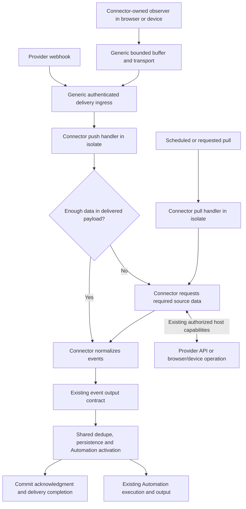
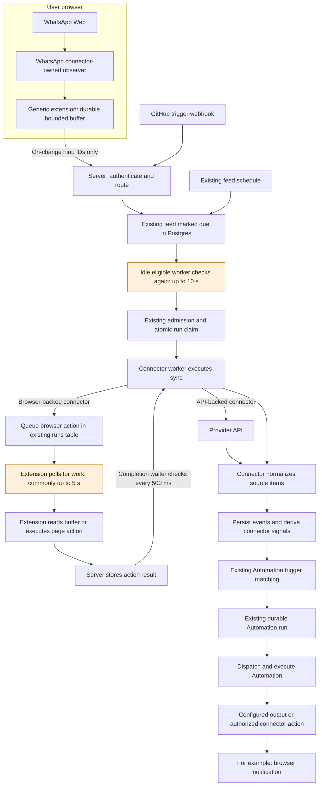
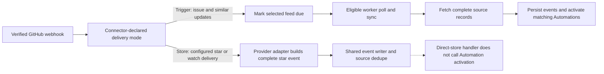
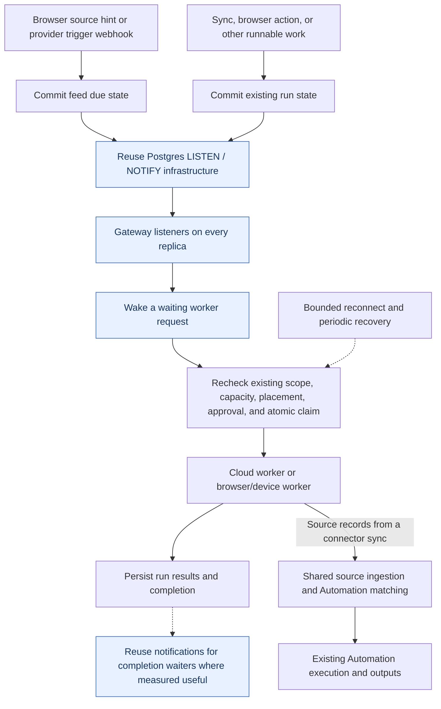

# Realtime feed dispatch: current architecture and consolidation proposal

Code snapshot: Lobu `a8e677aa0eb0d41069eb1fc0978403c0cea71235`, with Owletto `41de0c560165793a02985192ef2798552b22a061`, inspected on 2026-09-12.

The WhatsApp live-source transport was already implemented. Consolidation is in draft [PR #3519](https://github.com/lobu-ai/lobu/pull/3519), with foundation commit `8da05bee9` and additional local changes. Nothing from this consolidation has merged or deployed. The live WhatsApp feed still advertises only `sync` and has a five-minute schedule; it does not yet meet the requested result.

The local implementation adds `onDelivery` inside the existing isolate executor, batches browser records into the existing `runs.action_input`, and preserves the one-active-sync-run-per-feed constraint. Arrivals while a run executes stay in the browser's durable buffer. Complete WhatsApp text batches normalize without a browser/source read. Only exact successfully ingested revisions are acknowledged. Idle source checks and empty worker claims create no runs. A lone message can form a one-message batch; an Automation and its output actions have their own existing runs.

**Required WhatsApp outcome:** initial backfill, then observer-driven delivery with no recurring feed schedule. Explicit agent pulls remain available. Recovery and unfinished attachment work are actual work, not a reason to reintroduce periodic source collection. The remaining contract refinement awaiting explicit confirmation under AGENTS.md is a connector-requested follow-up while backfill has unfinished work; completion stops that chain. Separately, server webhooks need bounded durable batching: at most one pending run alongside one executing run per feed, enforced by indexes on existing `runs`. WhatsApp does not need that index change because its source owns the backlog. No new table or queue service is proposed.

Local evidence: a real HTTP gateway + Postgres + worker-loop test improved source signal to execution from **10,031 ms to 15 ms**. A real HTTP → installed connector isolate → stored events → Automation test proves shared ingestion, replay suppression and no idle sync runs. Chromium smoke covers a 150-message burst, partial ACK, extension reload and browser restart. Fault injection proves event delivery precedes checkpoint advancement, stale-run retry preserves its input, and completion plus the feed checkpoint commit atomically. These checks are not a new live WhatsApp self-message or GitHub webhook result. Backfill continuation, GitHub migration and old-path removal, required review, release and live proof remain outstanding. The mandated Opus review currently stops at a weekly quota limit without a verdict.

## 1. The existing concepts

| Concept | Responsibility | Example |
| --- | --- | --- |
| Connection | Provider account, access, and any device affinity | A connected WhatsApp browser or GitHub account |
| Feed | Selected source data, collection scope, schedule, and checkpoint | WhatsApp messages or GitHub issues for a configured repository |
| Run | A durable unit of executable work in Postgres | Collect messages, read a browser buffer, run an Automation, show a notification |
| Event | Persisted source information | A message or an updated issue; source identity uses connection + `origin_id` |
| Automation | Existing trigger matching and reaction processing | React to a new message, then request a notification |

There are two different signals: **a source-change hint makes a feed due**, while **a normalized event matching an Automation queues a reaction**. They already have different responsibilities inside the existing feed/run/Automation lifecycle.

## Recommended direction: complete the connector SDK boundary

The target is an integration implemented entirely in a connector package: its logic runs in an isolate and invokes authorized browser/device capabilities when needed. The core runtime owns generic execution, transport, authorization, durable state and ingestion. Adding a provider within supported capabilities should require no provider-specific gateway or extension changes.

### Agreed layering rule

Each higher-level feature composes the existing lower-level primitives. Source adapters may differ because a webhook, browser observer and scheduled API read receive data differently; execution, capability authorization, event output and ingestion must converge.

| Layer | Owns | Reuses |
| --- | --- | --- |
| Source adapter in the connector package | Provider observation, parsing and required reads | Generic HTTP/browser/device capabilities |
| Connector SDK execution | Pull or delivered-input invocation and normalized event output | Existing isolate executor, scoped host bridge and run lifecycle |
| Shared runtime | Durable receipt/work, claims, retry, event persistence and activation | Existing Postgres and event/Automation primitives |
| Automation | Configured reaction and authorized output | Existing event signals and connector actions |

An optional `onDelivery` hook is an authoring entry point, not permission to build another executor, queue, credential path, event writer or Automation dispatcher. Connector helpers for interpretation and fetching are shared between pull and push. Every new abstraction must identify the existing primitive it builds on and the duplication it replaces. An external connector must be able to exercise the stack without registering provider logic in core.

Both pull and push should enter the existing connector execution lifecycle:



A complete WhatsApp message still invokes connector code to interpret the payload. It needs **no additional source collection or browser reread**. This corrects the earlier proposal that placed final normalization in the page and bypassed connector execution. Removing a fetch does not remove isolate execution or its dispatch requirements.

The existing SDK already provides `sync`, `read`, actions, webhook registration, `EventEnvelope` results and a Chrome dispatch host capability. Its executable feed definition currently exposes only `sync` and `read`; the inbound webhook paths use server routing/handling, while browser notifications carry IDs only. The missing seam is a generic, bounded pushed input delivered to connector code with the same event output and host capabilities. The SDK hook is now implemented locally under the instruction to proceed. The storage and acknowledgment refinement is still pending the explicit confirmation noted above.

Reuse the existing `store` / `trigger` meanings as processing: emit from complete delivered data, or request collection for incomplete hints. The connector owns that choice; there is no additional user-facing subscription mode. Prefer extending existing execution and delivery primitives over a second source-processing engine. Do not move provider-specific normalization into generic extension or gateway code.

Push inputs must survive disconnects and process restarts. Delivery acceptance may acknowledge durable receipt, but must not masquerade as successful event ingestion; buffer release needs a clear durable ownership transfer or exact successful-ingestion acknowledgment. Preserve connection/org/device scope, bounded inputs, source identity, revisions and idempotent Automation activation across replay and catch-up. Use existing durable run/checkpoint primitives where they can express this lifecycle; no new table is assumed.

Initial observer setup, disconnect recovery, history catch-up and required media/details can invoke collection through the connector. The observer lives where the source events occur; it does not require an isolate to run forever. Arbitrary future native device capabilities may still require host work: the goal is zero provider-specific core changes for integrations using supported capabilities.

Prove the boundary with an installed external connector bundle, a real browser-originated WhatsApp message, and a provider webhook. Check complete payload, incomplete hint, scheduled pull, authorized browser action, duplicate/revised delivery and reconnect recovery. Verify the payload handler starts promptly: the measured 10-second worker polling delay must not simply move onto the new push execution path.

## Implementation sequence and acceptance gates

### 1. Settle the smallest SDK and delivery contract

Recommended public shape for review: an optional per-feed `onDelivery(ctx)` handler alongside existing `sync(ctx)` and `read(ctx)`. Both `sync` and `onDelivery` return the existing `SyncResult` / `EventEnvelope` output and use the same authorized host capabilities and shared ingestion. `onDelivery` receives bounded delivered source data with an opaque delivery identity, source revision where available, and the server-resolved feed context. These names and types are implemented locally and are not yet released.

The handler interprets the payload, emits from complete data, or calls connector-owned collection logic for missing data. Pull and push share that connector code; neither needs to invoke a public self-sync action or create a second subscription system. The `store` / `trigger` distinction remains processing, with metadata-only trigger feeds still able to request their existing sync.

Before implementation, settle these parts together in one contract review:

- Feed declaration, compilation/metadata extraction, class and functional SDK authoring, and push-only versus pull-only versus hybrid scheduling processing.
- Delivery routing and verification under the selected connector version; browser observation binding establishment, scope, revocation and recovery. Identify provider rules still requiring server plugins rather than silently treating them as SDK support.
- Bounded source input, durable receipt identity, retries and exact successful-ingestion acknowledgment. Browser transport acceptance must not clear its buffer as if ingestion succeeded.
- Mapping to existing run/input persistence, atomic claims and per-feed checkpoint concurrency. Prove multiple arrivals while a feed is busy are durably retained and later claimed; do not assume a due flag or overwritten checkpoint stores deliveries. Prefer existing storage, but explicitly surface any required DB change before implementing it.
- Same scoped browser/network capabilities for both handlers. Inventory device operations separately: the inspected isolate bridge exposes Chrome dispatch; arbitrary native device dispatch is not proven by that alone.

The user has confirmed the layered SDK direction and reuse of shared primitives. Carry that decision forward without asking again. Finish specifying the delivery/storage details within it; any genuinely new DB design or unsettled public contract must be surfaced under root AGENTS.md. The subsequent instruction to proceed authorizes the SDK and prompt-dispatch implementation; backfill continuation and the bounded server-webhook index refinement above remain separate pending decisions.

### 2. Build one generic vertical slice, including the external-connector proof

After contract approval, add a project-installed fixture connector and a failing integration test for authenticated pushed input → durable execution → connector isolate → normalized event → matching Automation. The fixture must have no registration in the built-in provider catalog or server source.

Implement only the generic gaps: input delivery, SDK handler dispatch, shared ingestion, existing capability wiring, and prompt execution. Audit existing event ingestion side effects before extracting them; preserve authorization, source identity, event kinds, checkpoint/ack processing and transactional Automation activation. Add no provider-name branches to shared runtime.

Required evidence: complete input produces an event without a source read; an incomplete hint makes the expected authorized read; scheduled pull still works; push-only feeds do not acquire a periodic poll. Prove duplicate/revised deliveries, several arrivals during a running job, cross-replica claims, process restart before/after commit, checkpoint concurrency and stale ACKs. Unauthorized cross-org/device submissions fail. Measure input receipt → isolate start and event commit separately. Keep the existing 10-second regression as a baseline until the selected shared dispatch fix satisfies the controlled under-one-second target.

### 3. Use WhatsApp as the browser proving integration

Move observed message payloads through the generic delivery bridge into WhatsApp connector code. Keep the page observer and source-specific interpretation connector-owned, and reuse its normalization and collection functions. Retain setup, catch-up, missing-data/media handling and reconnect recovery according to the contract.

Required evidence: a real self-message reaches the running extension, connector isolate, persisted event, matching Automation and visible notification. For a complete text message, assert no follow-up browser collection call. Separately exercise edits, duplicate delivery, extension restart and catch-up without duplicate new-message activation. Record each milestone's timestamp; a synthetic Playwright page supplements rather than replaces the real provider/device run.

### 4. Use GitHub to prove webhook parity and remove replaced paths

Route a verified provider delivery through the same SDK invocation and ingestion. Move the source-specific GitHub event mapping and feed-selection rules into its connector-owned SDK implementation. Preserve signature verification, installation/connection/feed scope and declared source identity. A complete star payload should emit directly; an incomplete hint should use the connector's normal read/collection logic.

Required evidence: provider-originated complete delivery and trigger delivery both reach the expected feed and Automation; scheduled resync and webhook replay consolidate without duplicate activation. This must cover the observed star direct-store activation gap. Reconcile every existing GitHub delivery entry point, including app-installation and registered-connection routes, before deleting the superseded handlers.

### 5. Release, verify and clean up each settled concern

Use separate reviewable PRs for the generic contract/runtime, WhatsApp adapter/extension changes, and GitHub migration, in dependency order; add an earlier internal-ingestion PR only if it has independently proven parity. Owletto content is reviewed and released in its own repository before the parent pointer change. Run required local gates, CI, semantic review, UI applicability checks and protected merge gates for each exact head, then verify the deployed squash SHA and live flow.

Remove a legacy path only after the replacement covers its production entry points and recovery processing. End with an ownership audit: a new external connector using supported host capabilities must implement installation/authentication, pull, push, browser actions and teardown through the SDK without a provider-specific server or extension edit. Record remaining native capability or provider lifecycle gaps explicitly; two passing providers do not prove every possible integration already works.

## 2. Current architecture

This diagram focuses on trigger-based feeds. GitHub's direct-store exception appears separately below.



The browser already pings the server on source activity. The first highlighted wait happens **after the server knows the feed changed**. Browser-backed syncs may encounter the second wait repeatedly because their connector code requests multiple browser actions. A browser notification is another such action.

The deployed extension attempts an immediate poll when the observer reports activity, but an in-flight request can defer that attempt until the next poll. The local change remembers one wake while a request is active and sends again immediately when it finishes. Repeated wakes coalesce; the durable source records stay in IndexedDB.

The connector's WhatsApp-specific observer runs in the page. Generic buffering and browser execution live in the extension. The parent WhatsApp sync, normalization, ingestion, and Automation matching run through the server/connector-worker system. Browser affinity chooses where the connector reads; it does not make the extension execute the parent connector bundle.

Automation event dispatch already attempts immediate execution after durable activation. Its periodic scheduler is a recovery path. Feed admission and scheduled Automation admission deliberately retain their existing eligibility rules; consolidation does not require moving both onto one global clock.

## 3. Deployed WhatsApp path before this consolidation

The following sequence records the deployed path being replaced. In the local replacement, an initial sync establishes the observer, the extension submits complete batches, and the connector skips this sequence’s repeated collection loop for complete text. Backfill continuation and the schedule cutover are still pending.

In the deployed path, an initial normal sync establishes the source binding and installs the connector-owned observer in the authorized page. After that:

```mermaid
sequenceDiagram
  participant Page as WhatsApp page
  participant Ext as Browser extension
  participant GW as Gateway
  participant DB as Postgres
  participant CW as Connector worker
  participant Auto as Automation executor
  Page->>Ext: Observer emits changed message record
  Ext->>Ext: Persist record and revision in local buffer
  Ext->>GW: POST existing worker endpoint with feed change hint
  GW->>DB: Authorize source; mark existing feed due
  GW-->>Ext: Scheduling receipt and last saved source acknowledgment
  Note over GW,CW: Current idle worker can wait up to 10 seconds
  CW->>GW: Poll for eligible work
  GW->>DB: Materialize due sync and atomically claim it
  GW-->>CW: Existing sync job
  loop Browser operations needed by this sync
    CW->>GW: Request generic browser operation
    GW->>DB: Queue device-bound action run
    Ext->>GW: Poll and claim authorized browser action
    Ext->>Page: Read source or run connector-owned adapter
    Ext->>GW: Complete action with buffered records or page result
    GW-->>CW: Return completed action result
  end
  CW->>GW: Stream normalized source events
  GW->>DB: Persist events and matching Automation runs
  GW->>Auto: Attempt immediate Automation dispatch
  Auto->>GW: Execute configured output, e.g. notification action
  GW->>DB: Queue notification action for selected browser
  Ext->>GW: Claim notification action
  Ext->>Ext: Show notification
  Ext->>GW: Report action completion
  CW->>GW: Complete successful sync with source checkpoint
  GW->>DB: Save successful source acknowledgment
  Ext->>GW: Next source receipt request
  GW-->>Ext: Saved acknowledgment of exact record revisions
  Ext->>Ext: Remove only acknowledged buffered revisions
```

Automation execution and sync completion may overlap; the sequence above illustrates their dependencies rather than requiring notification delivery to finish before sync completion. A scheduling receipt does not authorize dropping buffered messages. Successful source acknowledgments do. Replays use stable source identity, and an acknowledgment for an old revision must not remove a newer change.

## 4. GitHub: trigger delivery versus complete delivery



GitHub's **trigger** route uses the same `requestFeedSync` as browser source hints and therefore encounters the same worker-dispatch delay. A complete star event can be stored without that sync wait. These are source-delivery modes, not separate subscription systems.

There is a concrete consolidation gap to verify and address: `landGithubStarEvent` calls the shared event writer without the activation hook used by sync ingestion. Its handler does not invoke `activateAutomationSignal`. The proposed shared ingestion boundary should preserve provider normalization while applying the same declared-event matching, dedupe, and transactional activation processing to complete webhook deliveries. This is a code-path finding, not live proof that every GitHub Automation is broken.

## 5. Proposed shared dispatch for work that still needs execution

Complete messages bypass source collection, but still require prompt connector execution in an isolate. The dispatch problem must be measured for that invocation as well as incomplete hints, catch-up jobs and browser/output actions. Reuse existing execution infrastructure; select the smallest dispatch change needed to avoid carrying the measured idle delay into push handling.



Postgres state is authoritative. A notification is a prompt to check it, and contains no executable authority. Losing a notification must leave durable work recoverable. This works across gateway replicas because notifications cross processes through Postgres; an in-memory callback alone would not.

The proposed worker transport is a bounded held request on the **existing** `POST /api/workers/poll`. The optional `wait_seconds` field is the proposed protocol change awaiting approval. It is not implemented.

```mermaid
sequenceDiagram
  participant W as Idle worker
  participant G as Gateway
  participant P as Postgres
  participant E as Extension or webhook sender
  W->>G: Existing poll request, wait_seconds = 15
  G->>P: Listen, then check existing eligible work
  Note over W,G: Request remains open while no eligible work exists
  E->>G: Source change arrives after 200 ms
  G->>P: Commit feed due state and notify
  P-->>G: Wake notification on each listening replica
  G->>P: Recheck eligibility; materialize and atomically claim work
  G-->>W: Return job promptly after arrival and claim
  Note over W,G: The 15 seconds is a maximum idle wait, not an execution delay
```

If no work arrives, the request expires at its bound and the worker opens another one without adding the old idle sleep. New browser source hints must be sent promptly while a job request is held. The existing zero-capacity notification path provides a way to send those hints without accidentally claiming an additional job; the extension still needs the appropriate implementation and race tests.

## 6. Consolidation boundaries and acceptance evidence

| Keep connector-owned | Consolidate in shared runtime |
| --- | --- |
| Provider webhook verification and payload interpretation | Existing authorized source-to-feed routing |
| WhatsApp observer and extraction; each service's equivalent adapter | Existing generic extension buffering and browser operations |
| Provider API reads and provider-specific checkpoints | Durable run creation, eligibility, claims, and prompt wake-up |
| Declared event kinds and normalization | Event persistence, source dedupe, and matching Automation activation |

Gmail, X, and other services can use these shared runtime paths when their connectors implement the necessary source adapter. This diagram does not assert that each already has a working live push adapter. API notifications, webhooks, browser observers, and scheduled reads remain valid source-specific ways to discover changes.

Before calling the change complete:

1. Prove a complete observed message invokes the connector in an isolate, commits an event and activates its Automation without another source collection or browser reread; prove an incomplete hint still requests missing data.
2. Measure source observed, server receipt, due-state commit, sync claim, browser-action claim/completion, event commit, Automation start, and visible notification separately.
3. Meet the under-one-second idle-dispatch regression target in a controlled test; report source/provider/agent execution separately from dispatch overhead.
4. Prove notifications cross replicas, concurrent workers cannot double-claim, and auth/device/approval/capacity checks still apply after wake-up.
5. Prove source hints during held polls, busy workers, overlapping source changes, disconnects, lost notifications, reconnects, and stale revision acknowledgments recover correctly.
6. Test both GitHub trigger and direct-store ingestion parity, and repeat the real WhatsApp self-message-to-visible-notification flow after deployment.

## Current connector inventory and routes

This is an inspection of bundled source, the pinned Owletto manifests/handlers, and named example/remote paths. It is not a live connection or provider-health audit. There are 23 bundled definitions and 13 device manifests; installed custom versions require their own inspection. No current generic SDK push handler is implied by a source listener or streaming transport.

| Connector | Scope | Current delivery | Runs where | Output |
| --- | --- | --- | --- | --- |
| [WhatsApp Web](https://github.com/lobu-ai/lobu/blob/a8e677aa0eb0d41069eb1fc0978403c0cea71235/packages/connectors/src/whatsapp_web.ts#L621) | Bundled | Browser observer hint + collection | Observer in page; connector in isolate | Feed message events → Automations |
| [GitHub](https://github.com/lobu-ai/lobu/blob/a8e677aa0eb0d41069eb1fc0978403c0cea71235/packages/server/src/gateway/routes/public/app-webhooks.ts#L479) | Bundled | Pull + webhook trigger / store | Isolate for sync; server for webhook mapping | Normalized feed events; star activation parity gap |
| [Gmail](https://github.com/lobu-ai/lobu/blob/a8e677aa0eb0d41069eb1fc0978403c0cea71235/packages/connectors/src/google_gmail.ts) | Bundled | API pull | Connector isolate | Feed events |
| [Google Calendar](https://github.com/lobu-ai/lobu/blob/a8e677aa0eb0d41069eb1fc0978403c0cea71235/packages/connectors/src/google_calendar.ts) | Bundled | API pull | Connector isolate | Feed events |
| [Google Drive](https://github.com/lobu-ai/lobu/blob/a8e677aa0eb0d41069eb1fc0978403c0cea71235/packages/connectors/src/google_drive.ts) | Bundled | API pull | Connector isolate | Feed events |
| [X / Twitter](https://github.com/lobu-ai/lobu/blob/a8e677aa0eb0d41069eb1fc0978403c0cea71235/packages/connectors/src/x.ts#L3084) | Bundled | API or browser pull | Connector isolate + optional Chrome actions | Feed events; draft action output |
| [LinkedIn example](https://github.com/lobu-ai/lobu/blob/a8e677aa0eb0d41069eb1fc0978403c0cea71235/examples/personal-agent/linkedin.connector.ts) | Example | Browser pull + local export import | Connector isolate + browser/file capabilities | Feed events; page-activated draft output |
| [Jira (bundled)](https://github.com/lobu-ai/lobu/blob/a8e677aa0eb0d41069eb1fc0978403c0cea71235/packages/server/src/gateway/routes/public/jira-mcp-webhook-delivery.ts) | Bundled | API pull + app webhook routing | Isolate for pull; server webhook adapter | Pull events/rows; webhook output depends on target |
| [Linear](https://github.com/lobu-ai/lobu/blob/a8e677aa0eb0d41069eb1fc0978403c0cea71235/packages/connectors/src/linear.ts#L143) | Bundled | API pull + raw webhook store | Isolate for pull; server for webhook ingestion | Normalized pull events/rows; raw webhook event |
| [Atlassian Rovo issue feed](https://github.com/lobu-ai/lobu/blob/a8e677aa0eb0d41069eb1fc0978403c0cea71235/packages/server/src/gateway/routes/public/jira-mcp-webhook-delivery.ts) | Remote path | MCP source reads + Jira webhook adapter | Remote MCP + server-owned feed adapter | Structured issue events + declared activation |
| [Market quotes](https://github.com/lobu-ai/lobu/blob/a8e677aa0eb0d41069eb1fc0978403c0cea71235/packages/connectors/src/market_quotes.ts) | Bundled | On-demand API action | Connector isolate | Action result; no raw quote events |
| [Hacker News](https://github.com/lobu-ai/lobu/blob/a8e677aa0eb0d41069eb1fc0978403c0cea71235/packages/connectors/src/hackernews.ts) | Bundled | API pull | Connector isolate | Feed events |
| [Outlook](https://github.com/lobu-ai/lobu/blob/a8e677aa0eb0d41069eb1fc0978403c0cea71235/packages/connectors/src/microsoft_outlook.ts) | Bundled | API pull | Connector isolate | Feed events |
| [Postgres](https://github.com/lobu-ai/lobu/blob/a8e677aa0eb0d41069eb1fc0978403c0cea71235/packages/connectors/src/postgres.ts) | Bundled | SQL pull / live read | Connector isolate | Events for sync; rows for live reads |
| [Product Hunt](https://github.com/lobu-ai/lobu/blob/a8e677aa0eb0d41069eb1fc0978403c0cea71235/packages/connectors/src/producthunt.ts) | Bundled | API pull | Connector isolate | Feed events |
| [RSS](https://github.com/lobu-ai/lobu/blob/a8e677aa0eb0d41069eb1fc0978403c0cea71235/packages/connectors/src/rss.ts) | Bundled | API pull | Connector isolate | Feed events |
| [Reddit](https://github.com/lobu-ai/lobu/blob/a8e677aa0eb0d41069eb1fc0978403c0cea71235/packages/connectors/src/reddit.ts) | Bundled | API pull | Connector isolate | Feed events |
| [YouTube](https://github.com/lobu-ai/lobu/blob/a8e677aa0eb0d41069eb1fc0978403c0cea71235/packages/connectors/src/youtube.ts) | Bundled | API pull | Connector isolate | Feed events |
| [Discord](https://github.com/lobu-ai/lobu/blob/a8e677aa0eb0d41069eb1fc0978403c0cea71235/packages/server/src/gateway/connections/platforms/discord.ts) | Bundled | Chat adapter inbound delivery | Server Chat SDK / platform adapter | Channel messages, agent conversations and replies |
| [Google Chat](https://github.com/lobu-ai/lobu/blob/a8e677aa0eb0d41069eb1fc0978403c0cea71235/packages/server/src/gateway/connections/platforms/gchat.ts) | Bundled | Chat app / add-on webhook | Server Chat SDK / platform adapter | Channel messages, agent conversations and replies |
| [Microsoft Teams](https://github.com/lobu-ai/lobu/blob/a8e677aa0eb0d41069eb1fc0978403c0cea71235/packages/server/src/gateway/connections/platforms/teams.ts) | Bundled | Bot / chat adapter delivery | Server Chat SDK / platform adapter | Channel messages, agent conversations and replies |
| [Slack](https://github.com/lobu-ai/lobu/blob/a8e677aa0eb0d41069eb1fc0978403c0cea71235/packages/server/src/gateway/connections/platforms/slack.ts) | Bundled | App webhook / chat adapter | Server Chat SDK / platform adapter | Channel messages, agent conversations and replies |
| [Telegram](https://github.com/lobu-ai/lobu/blob/a8e677aa0eb0d41069eb1fc0978403c0cea71235/packages/server/src/gateway/connections/platforms/telegram.ts) | Bundled | Webhook; optional self-host long polling | Server Chat SDK / platform adapter | Channel messages, agent conversations and replies |
| [WhatsApp Cloud](https://github.com/lobu-ai/lobu/blob/a8e677aa0eb0d41069eb1fc0978403c0cea71235/packages/server/src/gateway/connections/platforms/whatsapp.ts) | Bundled | Cloud API chat webhook | Server Chat SDK / platform adapter | Channel messages, agent conversations and replies |
| [Other installed custom connectors](https://github.com/lobu-ai/lobu/blob/a8e677aa0eb0d41069eb1fc0978403c0cea71235/docs/connector-authoring.md) | Installation-specific | Inspect the installed source/version | Depends on connector definition | Declared feed / action contract |
| [Apple Health](https://github.com/lobu-ai/owletto/blob/41de0c560165793a02985192ef2798552b22a061/apps/mac/Owletto/NativeCapabilityBridge.swift) | Device manifest | Native read + sync | Native device bridge / daemon | Events for sync; rows for supported read |
| [Apple Photos](https://github.com/lobu-ai/owletto/blob/41de0c560165793a02985192ef2798552b22a061/apps/mac/Owletto/NativeCapabilityBridge.swift) | Device manifest | Native sync | Native device bridge / daemon | Events for sync; rows for supported read |
| [Apple Screen Time](https://github.com/lobu-ai/owletto/blob/41de0c560165793a02985192ef2798552b22a061/apps/mac/Owletto/NativeCapabilityBridge.swift) | Device manifest | Native read + sync | Native device bridge / daemon | Events for sync; rows for supported read |
| [Calendar](https://github.com/lobu-ai/owletto/blob/41de0c560165793a02985192ef2798552b22a061/apps/mac/Owletto/NativeCapabilityBridge.swift) | Device manifest | Native read + sync | Native device bridge / daemon | Events for sync; rows for supported read |
| [Chrome bookmarks](https://github.com/lobu-ai/owletto/blob/41de0c560165793a02985192ef2798552b22a061/apps/chrome/background.js#L933) | Device manifest | Browser-native feed runs | Chrome extension worker | Feed events; Chrome also returns action results |
| [Chrome downloads](https://github.com/lobu-ai/owletto/blob/41de0c560165793a02985192ef2798552b22a061/apps/chrome/background.js#L933) | Device manifest | Browser-native feed runs | Chrome extension worker | Feed events; Chrome also returns action results |
| [Chrome history](https://github.com/lobu-ai/owletto/blob/41de0c560165793a02985192ef2798552b22a061/apps/chrome/background.js#L933) | Device manifest | Browser-native feed runs | Chrome extension worker | Feed events; Chrome also returns action results |
| [Chrome tabs / actions](https://github.com/lobu-ai/owletto/blob/41de0c560165793a02985192ef2798552b22a061/apps/chrome/background.js#L933) | Device manifest | Browser-native feed runs | Chrome extension worker | Feed events; Chrome also returns action results |
| [Local Folder](https://github.com/lobu-ai/owletto/blob/41de0c560165793a02985192ef2798552b22a061/apps/mac/Owletto/NativeCapabilityBridge.swift) | Device manifest | Native read + sync | Native device bridge / daemon | Events for sync; rows for supported read |
| [Mac Computer Use](https://github.com/lobu-ai/owletto/blob/41de0c560165793a02985192ef2798552b22a061/apps/mac/Owletto/NativeCapabilityBridge.swift) | Device manifest | Native action | Native device bridge / daemon | Action result |
| [Meeting Audio](https://github.com/lobu-ai/owletto/blob/41de0c560165793a02985192ef2798552b22a061/apps/mac/Owletto/NativeCapabilityBridge.swift) | Device manifest | Native sync | Native device bridge / daemon | Events for sync; rows for supported read |
| [Reminders](https://github.com/lobu-ai/owletto/blob/41de0c560165793a02985192ef2798552b22a061/apps/mac/Owletto/NativeCapabilityBridge.swift) | Device manifest | Native read + sync | Native device bridge / daemon | Events for sync; rows for supported read |
| [Shell](https://github.com/lobu-ai/owletto/blob/41de0c560165793a02985192ef2798552b22a061/apps/mac/Owletto/NativeCapabilityBridge.swift) | Device manifest | Native action | Native device bridge / daemon | Action result |
| [Remote MCP connectors](https://github.com/lobu-ai/lobu/blob/a8e677aa0eb0d41069eb1fc0978403c0cea71235/docs/connector-authoring.md) | Remote path | Tool calls / declared feed reads | Gateway MCP proxy + remote server | Tool results; feed processing depends on declared adapter |
| [Inbound webhook](https://github.com/lobu-ai/lobu/blob/a8e677aa0eb0d41069eb1fc0978403c0cea71235/packages/server/src/gateway/connections/webhook-ingest.ts) | Bundled | Authenticated raw JSON push | Gateway ingestion | Raw event + delivery.received Automation signal |

### Important route distinctions

- Gmail, Calendar, Drive and Outlook declare collection handlers, not provider watch/Pub/Sub subscription handling in their bundled definitions. Incremental cursors are still pull.
- WhatsApp Web observes and buffers messages, sends identifiers, then executes a connector sync with browser reads. The proposed delivered-input SDK route removes the extra collection for complete messages.
- X and the LinkedIn example use browser network interception during collection; this does not establish persistent provider push support.
- GitHub trigger webhooks schedule a sync; complete star delivery uses server-side mapping/direct storage, whose Automation activation needs parity.
- Jira app deliveries can map into a matching Atlassian Rovo issue feed through a server adapter; without that target they can fall through to raw storage. Linear app deliveries use the raw fallback alongside separate normalized API collection.
- Chrome history/bookmark/download listeners buffer local events. The inspected extension feeds drain through claimed runs and the run-authorized stream endpoint. Manifest wording about streaming is not evidence of immediate unsolicited server delivery.
- Native Apple/local connectors execute through a signed device capability bridge and declare sync/read/action operations. Do not represent these as arbitrary SDK isolate code today. System audio captures only while user-started recording is active.
- Slack, Telegram, Discord, Google Chat, Teams and WhatsApp Cloud are chat integrations with server Chat SDK adapters. Their message/thread output is distinct from source feed ingestion; the feed-push consolidation does not itself migrate these adapters.
- Market quotes is an action-only result path; live SQL/feed reads and MCP tools need not persist their output as events.
- Remote MCP transport streaming is not a generic domain-event subscription. Inventory its installed tools and feed adapter separately.

### Full proposed lifecycle

Connection setup and scoped authentication → subscribe/install observer or schedule collection → authenticated durable delivery → scoped connector execution → optional source capabilities → normalized event output → shared persistence and declared activation → Automation/output → explicit commit acknowledgment and recovery. Keep source observation, processing, and user-visible completion as separately measured milestones.

## Source map

- Existing delivery semantics: [connector-types.ts](../../packages/connector-sdk/src/connector-types.ts#L524). Browser IDs-only protocol: [protocol.ts](../../packages/core/src/contracts/worker/protocol.ts#L144).
- Connector-owned event normalization: [whatsapp-web-helpers.ts](../../packages/connectors/src/whatsapp-web-helpers.ts#L476).

- Browser observer transport and acknowledgment: [feed-listener.js](../../packages/owletto/apps/chrome/feed-listener.js), [background.js](../../packages/owletto/apps/chrome/background.js), [poll-schedule.js](../../packages/owletto/apps/chrome/poll-schedule.js).
- WhatsApp extraction and checkpoint: [whatsapp_web.ts](../../packages/connectors/src/whatsapp_web.ts), [whatsapp-web-adapter.js](../../packages/connectors/src/whatsapp-web-adapter.js).
- Browser/provider feed wake hints: [feed-notifications.ts](../../packages/server/src/runs/feed-notifications.ts), [app-webhooks.ts](../../packages/server/src/gateway/routes/public/app-webhooks.ts).
- Admission and execution dispatch: [poll.ts](../../packages/server/src/worker-api/poll.ts), [poll-loop.ts](../../packages/connector-worker/src/daemon/poll-loop.ts), [check-due-feeds.ts](../../packages/server/src/scheduled/check-due-feeds.ts).
- Browser action queue and result waits: [dispatch-chrome-action.ts](../../packages/server/src/worker-api/dispatch-chrome-action.ts), [device-action-wait.ts](../../packages/server/src/tools/admin/device-action-wait.ts).
- Event persistence and Automation activation: [run-lifecycle.ts](../../packages/server/src/worker-api/run-lifecycle.ts), [insert-event.ts](../../packages/server/src/utils/insert-event.ts), [activation.ts](../../packages/server/src/automations/activation.ts).
- Existing durable queue and notification infrastructure: [runs-queue.ts](../../packages/server/src/gateway/infrastructure/queue/runs-queue.ts), [task-scheduler.ts](../../packages/server/src/scheduled/task-scheduler.ts), [db/client.ts](../../packages/server/src/db/client.ts).
- Existing lifecycle boundaries: [CONCEPTS.md](../CONCEPTS.md), [AUTOMATIONS.md](../AUTOMATIONS.md).
- Latency reproduction: [worker-dispatch-latency.test.ts](../../packages/server/src/__tests__/integration/worker-dispatch-latency.test.ts).
